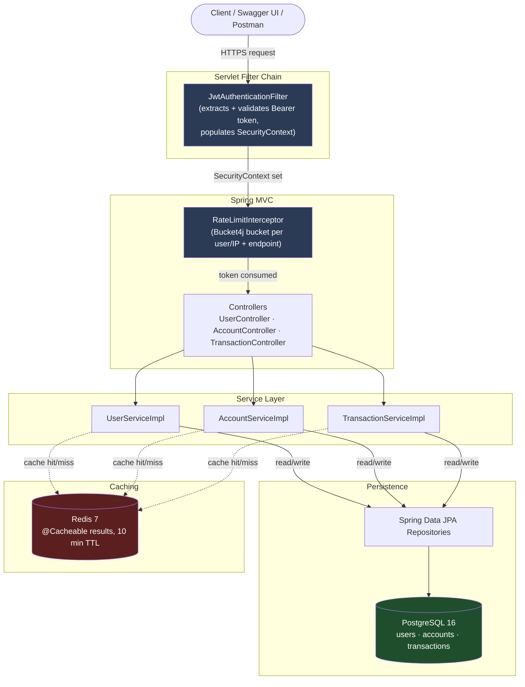
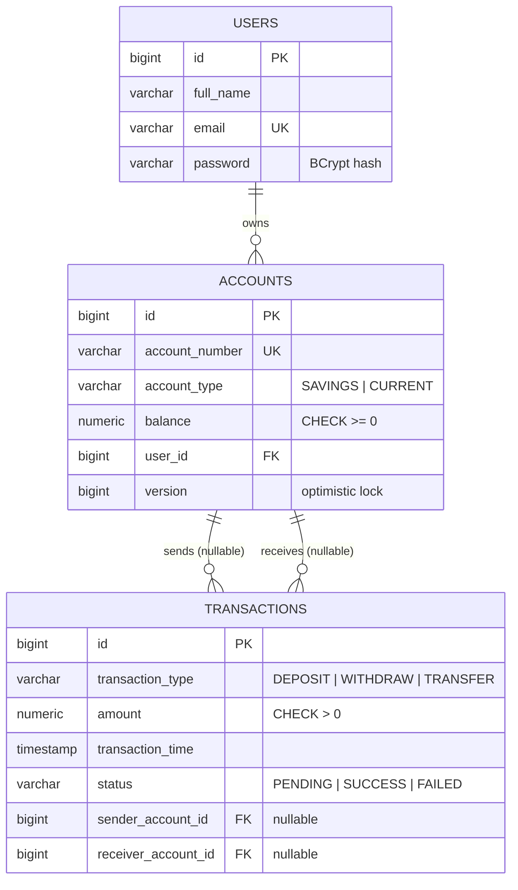
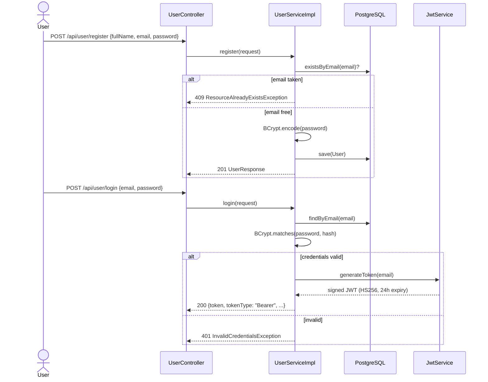
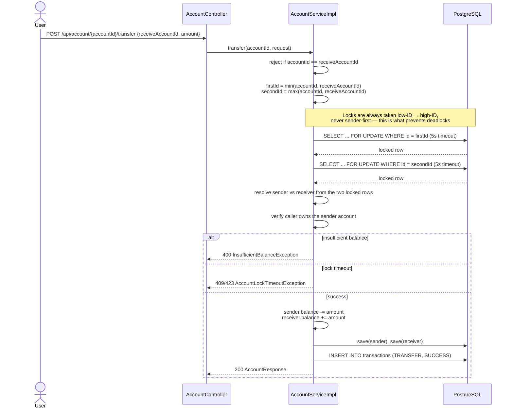
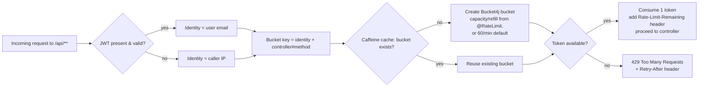

<div align="center">

# 🏦 Banking System

**A production-grade backend banking engine built with Spring Boot 3, PostgreSQL, and Redis**

*JWT authentication · Deadlock-safe money transfers · Rate limiting · Distributed caching · Flyway-versioned schema*

[](https://openjdk.org/)
[](https://spring.io/projects/spring-boot)
[](https://www.postgresql.org/)
[](https://redis.io/)
[](https://flywaydb.org/)
[](LICENSE)

</div>

---

## 📖 Table of Contents

1. [Overview](#-overview)
2. [Feature Set](#-feature-set)
3. [Architecture](#-architecture)
4. [Database Design](#-database-design)
5. [Core Flows](#-core-flows)
6. [Technology Stack](#-technology-stack)
7. [Project Structure](#-project-structure)
8. [Getting Started](#-getting-started)
9. [API Reference](#-api-reference)
10. [Security Deep Dive](#-security-deep-dive)
11. [Concurrency & Data Integrity](#-concurrency--data-integrity)
12. [Caching Strategy](#-caching-strategy)
13. [Testing](#-testing)
14. [Strengths — What This Project Gets Right](#-strengths--what-this-project-gets-right)
15. [Known Limitations & Findings](#-known-limitations--findings)
16. [Roadmap](#-roadmap)
17. [Contributing](#-contributing)
18. [License](#-license)

---

## 🔍 Overview

**Banking System** is a RESTful backend that models the core of a retail banking platform: customer onboarding, multi-account ownership, and money movement (deposits, withdrawals, transfers) backed by an immutable transaction ledger.

It is written as a layered Spring Boot application with a strong emphasis on **correctness under concurrency** (row-level locking, deadlock-avoidance ordering) and **defense-in-depth security** (stateless JWT auth, BCrypt hashing, per-endpoint rate limiting). The schema is version-controlled with Flyway rather than left to Hibernate auto-DDL, and reads are accelerated with a Redis-backed second-level cache.

This is not a toy CRUD demo — it implements the two hardest problems in a banking backend correctly: **atomic double-entry money transfers between two independently-locked rows**, and **stateless authentication without leaking authorization state**.

---

## ✨ Feature Set

### 👤 Identity & Access
- Self-service registration (`full name`, `email`, `password`) with server-side uniqueness enforcement (both a pre-check and a DB unique-constraint fallback).
- Stateless **JWT** login — no server-side session store.
- Authenticated profile read/update (`GET/PUT /api/user/me`) and password change with re-verification of the current password.
- Passwords are **never** returned in any API response (`@JsonIgnore` on the entity field) and are hashed with **BCrypt** before touching the database.

### 🏦 Account Management
- Multiple accounts per user, typed as `SAVINGS` or `CURRENT`.
- Cryptographically random 10-digit account numbers (`SecureRandom`), guaranteed unique via a retry loop against the database.
- Balances are `NUMERIC(19,2)` end-to-end (Java `BigDecimal` ↔ Postgres `NUMERIC`) — **no floating-point money**.
- A database `CHECK` constraint prevents balances from ever going negative at the storage layer, independent of application logic.

### 💸 Transactions
- **Deposit**, **Withdraw**, and **Transfer** operations, each producing an immutable row in the `transactions` ledger.
- Transfers are atomic: either both the debit and the credit succeed, or neither does.
- Transaction history queryable globally (scoped to the caller), by transaction ID, or by account.
- Every transaction is stamped with a `TransactionType` (`DEPOSIT` / `WITHDRAW` / `TRANSFER`) and a `TransactionStatus` (`PENDING` / `SUCCESS` / `FAILED`).

### 🛡 Cross-Cutting Concerns
- **Rate limiting** on every `/api/**` route via a custom `@RateLimit` annotation, backed by **Bucket4j** token buckets cached in **Caffeine** — with tighter, hand-tuned limits on auth and money-movement endpoints, and looser defaults elsewhere. `429` responses carry a `Retry-After` header with the real wait time.
- **Redis-backed response caching** (`@Cacheable`) on hot read paths (account lookup, user profile, transaction history).
- **Centralized exception handling** — a single `@RestControllerAdvice` maps 10 custom exceptions + framework exceptions (validation, optimistic/pessimistic locking failures) to precise HTTP status codes with a consistent JSON error envelope.
- **OpenAPI 3 / Swagger UI** auto-generated and publicly browsable at `/swagger-ui.html`.
- **Flyway**-versioned schema — three migrations create `users`, `accounts`, and `transactions` with explicit constraints, indexes, and column comments.
- Health/info actuator endpoints exposed for basic liveness monitoring.

---

## 🏗 Architecture

The application follows a classic layered architecture, with two cross-cutting interceptors (JWT auth and rate limiting) sitting in front of every controller.



**Layer responsibilities**

| Layer | Responsibility |
|---|---|
| **Filter** | Authenticates the request statelessly by validating the JWT and populating `SecurityContextHolder`. No filter-level authorization — everything past this point is "authenticated or not." |
| **Interceptor** | Enforces per-identity, per-endpoint request quotas before the controller method ever runs. |
| **Controller** | Thin HTTP adapters — validate the request body (`@Valid`), delegate to a service, map the result to a `ResponseEntity`. |
| **Service** | All business rules live here: ownership checks, balance math, locking strategy, cache annotations, transaction boundaries (`@Transactional`). |
| **Repository** | Spring Data JPA interfaces; one repository (`AccountRepository`) carries a custom `@Lock(PESSIMISTIC_WRITE)` query. |
| **Database** | PostgreSQL enforces the invariants the application *should* uphold anyway (uniqueness, non-negative balances, referential integrity) as a last line of defense. |

---

## 🗄 Database Design

Three tables, Flyway-versioned (`V1`–`V3`), with explicit constraints rather than relying on ORM auto-generation.



**Notable schema decisions**

- `ck_accounts_balance_non_negative` and `ck_transactions_amount_positive` are enforced **in the database**, not just in Java — a bug in application code cannot silently create a negative balance or a zero/negative-amount transaction.
- `sender_account_id` / `receiver_account_id` are both nullable *by design*: a `DEPOSIT` has no sender, a `WITHDRAW` has no receiver, a `TRANSFER` has both. A `ck_transactions_parties_present` constraint guarantees at least one is always set.
- Foreign keys use `ON DELETE CASCADE` (accounts → user) and `ON DELETE SET NULL` (transactions → accounts), so deleting a user cleans up their accounts, but historical transactions survive account deletion with a null reference rather than disappearing.
- `idx_transactions_transaction_time DESC` supports the "most recent first" access pattern used by every transaction-history endpoint.

---

## 🔄 Core Flows

### 1. Registration & Authentication



Every subsequent request carries `Authorization: Bearer <token>`. The `JwtAuthenticationFilter` verifies the signature and expiry, extracts the email as the principal, and — critically — grants **no authorities**. This means the system currently has exactly two access states: *authenticated* or *anonymous*. There is no role hierarchy (see [Limitations](#-known-limitations--findings)).

### 2. Deadlock-Safe Money Transfer

The transfer path is the most interesting piece of engineering in this repository. Two different accounts must be debited and credited atomically — but locking them in an arbitrary order (e.g., always "sender first") is a classic deadlock trap: if User A transfers to User B at the same instant User B transfers to User A, each transaction locks its own sender first and then blocks forever waiting for the other's lock.

This codebase avoids that by **always acquiring locks in ascending account-ID order**, regardless of who is sender and who is receiver:



Deposits and withdrawals follow the same pattern with a single locked row: `findByIdForUpdate` takes a `PESSIMISTIC_WRITE` lock with a 5-second `jakarta.persistence.lock.timeout`, so a stuck transaction fails fast with a `409 Conflict` instead of hanging the connection pool indefinitely.

### 3. Request Lifecycle (Rate Limiting)



---

## 🛠 Technology Stack

| Layer | Technology | Notes |
|---|---|---|
| **Language / Runtime** | Java 17 | LTS release |
| **Framework** | Spring Boot 3.5.16 | Web, Data JPA, Security, Validation starters |
| **Database** | PostgreSQL 16 (Alpine) | Runs via Docker Compose on host port `5332` |
| **Schema Migration** | Flyway (core + PostgreSQL dialect) | 3 versioned migrations, baseline-on-migrate enabled |
| **Cache** | Redis 7 (Alpine) via `spring-boot-starter-data-redis` | JSON serialization with polymorphic typing, 10-minute TTL |
| **Auth** | JJWT 0.12.6 (`jjwt-api`/`impl`/`jackson`) | HMAC-SHA256, Base64-encoded 256-bit secret |
| **Password Hashing** | Spring Security `BCryptPasswordEncoder` | |
| **Rate Limiting** | Bucket4j 8.10.1 + Caffeine 3.1.8 | Custom `@RateLimit` annotation + `HandlerInterceptor` |
| **API Docs** | springdoc-openapi-starter-webmvc-ui 2.5.0 | Swagger UI at `/swagger-ui.html` |
| **ORM** | Hibernate (via Spring Data JPA) | `ddl-auto=validate` — schema truth lives in Flyway, not Hibernate |
| **Validation** | Jakarta Bean Validation | `@NotBlank`, `@Email`, `@Positive`, `@Size`, etc. on every request DTO |
| **Boilerplate Reduction** | Lombok | `@Getter`/`@Setter`/`@NoArgsConstructor` on entities |
| **Build** | Maven (with wrapper `mvnw`/`mvnw.cmd`) | |
| **Containerization** | Docker Compose | PostgreSQL + Redis services |
| **Testing** | JUnit 5, Mockito, Spring Security Test, `@WebMvcTest` | 61 test methods across 11 files |

---

## 📁 Project Structure

```
Banking-System/
├── src/main/java/com/banking/
│   ├── BankingSystemApplication.java      # @SpringBootApplication, @EnableCaching
│   ├── annotation/ratelimit/
│   │   ├── RateLimit.java                 # @RateLimit(capacity, refillTokens, refillPeriodSeconds)
│   │   ├── RateLimitInterceptor.java      # runs on every /api/** call
│   │   └── RateLimitService.java          # Caffeine-backed Bucket4j bucket registry
│   ├── config/
│   │   ├── SecurityConfig.java            # JWT filter chain, BCrypt bean, stateless sessions
│   │   ├── RedisCacheConfig.java          # RedisCacheManager, Jackson polymorphic serializer, 10 min TTL
│   │   ├── WebConfig.java                 # registers the rate-limit interceptor on /api/**
│   │   └── OpenApiConfig.java             # Swagger/OpenAPI metadata bean
│   ├── controller/
│   │   ├── UserController.java
│   │   ├── AccountController.java
│   │   └── TransactionController.java
│   ├── dto/
│   │   ├── account/    # Create/Deposit/Withdraw/Transfer requests + AccountResponse
│   │   ├── auth/       # Login/Register requests + responses, ErrorResponse
│   │   ├── transaction/# TransactionResponse
│   │   └── user/       # Profile & password DTOs
│   ├── exception/      # GlobalExceptionHandler + 10 custom exceptions
│   ├── model/           # User, Account, Transaction + AccountType, TransactionType, TransactionStatus
│   ├── repository/      # JPA repositories (AccountRepository holds the pessimistic-lock query)
│   ├── security/        # JwtAuthenticationFilter, JwtService, SecurityUtils
│   └── service/          # Interfaces + impl/ (all business logic + @Transactional boundaries)
├── src/main/resources/
│   ├── application.properties             # shared config (JWT expiry, cache, actuator, Redis host)
│   ├── application-dev.properties         # dev DB creds, ddl-auto=validate, DEBUG logging
│   └── db/migration/
│       ├── V1__create_users_table.sql
│       ├── V2__create_accounts_table.sql
│       └── V3__create_transactions_table.sql
├── src/test/java/com/banking/             # 61 tests: controllers, services, security
├── docker-compose.yml                     # PostgreSQL 16 + Redis 7
├── pom.xml
├── mvnw / mvnw.cmd
└── LICENSE                                # Apache 2.0
```

---

## 🚀 Getting Started

### Prerequisites
- **Java 17+** (JDK 21+ recommended — see the virtual-threads note in [Limitations](#-known-limitations--findings))
- **Maven 3.6+** (or use the bundled `./mvnw`)
- **Docker & Docker Compose** (for PostgreSQL + Redis)

### 1. Clone the repository
```bash
git clone https://github.com/Muhaimin-Mukammel/Banking-System.git
cd Banking-System
```

### 2. Start infrastructure (PostgreSQL + Redis)
```bash
docker-compose up -d
```
This starts:
- **PostgreSQL 16** on host port `5332` → container `5432` (database `banking_system`, user/pass `postgres`/`postgres`)
- **Redis 7** on host port `6379`

> On Docker Compose V2, use `docker compose` (no hyphen).

### 3. Review configuration

`src/main/resources/application.properties` (shared):
```properties
spring.application.name=Banking_System
spring.profiles.active=dev
jwt.expiration-ms=86400000        # 24 hours
spring.data.redis.host=localhost
spring.data.redis.port=6379
springdoc.swagger-ui.enabled=true
```

`src/main/resources/application-dev.properties` (dev profile):
```properties
spring.datasource.url=jdbc:postgresql://localhost:5332/banking_system
spring.datasource.username=postgres
spring.datasource.password=postgres

spring.jpa.hibernate.ddl-auto=validate     # Flyway owns the schema
spring.flyway.baseline-on-migrate=true

jwt.secret=Y2hhbmdlLXRoaXMtc2VjcmV0LWtleS1mb3ItcHJvZHVjdGlvbi11c2Utb25seSE=
```

> **⚠️ Before deploying anywhere real:** replace `jwt.secret` with a freshly generated Base64 256-bit key (`openssl rand -base64 32`) and move it — and the datasource credentials — out of version control (e.g. environment variables or a secrets manager). The committed value is a placeholder and is **not safe to use in production.**

### 4. Build & run
```bash
# using the Maven wrapper
./mvnw clean install
./mvnw spring-boot:run
```
The API starts at **http://localhost:8080**.
Interactive API docs: **http://localhost:8080/swagger-ui.html**

### 5. Run the test suite
```bash
./mvnw test
```

---

## 📡 API Reference

Every `/api/**` route is rate-limited (default **60 requests/min**, keyed by authenticated email or, for anonymous callers, by IP). Overridden limits are noted below. Exceeding a limit returns `429 Too Many Requests` with a `Retry-After` header.

### Authentication & User — base path `/api/user`

| Method | Endpoint | Auth | Rate Limit | Description |
|---|---|---|---|---|
| `POST` | `/register` | Public | 5/min | Create a new user account |
| `POST` | `/login` | Public | 10/min | Exchange credentials for a JWT |
| `GET` | `/me` | 🔒 | 60/min | Fetch the caller's profile |
| `PUT` | `/me` | 🔒 | 60/min | Update full name / email |
| `PUT` | `/password` | 🔒 | 30/min | Change password (requires current password) |

### Accounts — base path `/api/account`

| Method | Endpoint | Auth | Rate Limit | Description |
|---|---|---|---|---|
| `POST` | `/create` | 🔒 | 60/min | Open a new `SAVINGS` or `CURRENT` account |
| `GET` | `/{accountId}` | 🔒 | 60/min | Fetch an account owned by the caller |
| `POST` | `/{accountId}/deposit` | 🔒 | 20/min | Credit the account |
| `POST` | `/{accountId}/withdraw` | 🔒 | 20/min | Debit the account (fails on insufficient funds) |
| `POST` | `/{accountId}/transfer` | 🔒 | 20/min | Atomically move funds to another account |

### Transactions — base path `/api/transaction`

| Method | Endpoint | Auth | Description |
|---|---|---|---|
| `GET` | `/` | 🔒 | All transactions where the caller is sender or receiver |
| `GET` | `/{transactionId}` | 🔒 | A single transaction (caller must be sender or receiver) |
| `GET` | `/account/{accountId}` | 🔒 | Transaction history for one owned account, newest first |

### Sample error envelope
Every failure — validation, business rule, or unexpected exception — returns a consistent shape:
```json
{
  "timestamp": "2026-07-09T10:15:30",
  "status": 400,
  "error": "Bad Request",
  "message": "Insufficient balance for this withdrawal",
  "path": "/api/account/42/withdraw",
  "validationErrors": null
}
```

---

## 🔐 Security Deep Dive

- **Stateless JWT auth**: `JwtService` signs tokens with HMAC-SHA256 using a Base64-decoded secret (enforced ≥ 32 bytes at startup — the app refuses to boot with a weak key). Tokens carry the user's email as `sub`, an `iat`, and a 24-hour `exp`.
- **`JwtAuthenticationFilter`** runs once per request (`OncePerRequestFilter`), reads the `Authorization: Bearer <token>` header, and — if the signature and expiry check out — sets a `UsernamePasswordAuthenticationToken` with **no granted authorities** on the `SecurityContext`. Swagger and API-docs paths are explicitly bypassed.
- **`SecurityConfig`** disables CSRF (appropriate for a stateless, non-browser-session API), forces `SessionCreationPolicy.STATELESS`, whitelists `/api/user/register`, `/api/user/login`, and the Swagger paths, and requires authentication for everything else.
- **Password storage**: `BCryptPasswordEncoder` with default cost factor; the raw password is never logged, persisted, or echoed back (`@JsonIgnore` on `User.password`).
- **Authorization** (as opposed to authentication) is enforced **per-service-method**, not by Spring Security roles: `SecurityUtils.getCurrentUserEmail()` pulls the authenticated principal, and each service method explicitly checks `account.getUser().getId().equals(currentUser.getId())` before allowing access.

---

## ⚙️ Concurrency & Data Integrity

Money-moving code is the part of any banking system where subtle bugs are most expensive, and this project takes it seriously:

- **Pessimistic row locking**: every balance mutation (`deposit`, `withdraw`, `transfer`) acquires a `SELECT ... FOR UPDATE` lock (`AccountRepository.findByIdForUpdate`) with a **5-second lock timeout**, so a stuck transaction fails fast (`AccountLockTimeoutException` → `409`) instead of hanging.
- **Deadlock avoidance via canonical lock ordering**: transfers always lock the lower account ID before the higher one, regardless of which side is sender or receiver. This is the standard technique for avoiding the classic "A→B and B→A at the same instant" deadlock, and it's implemented correctly here.
- **Optimistic locking as a second line of defense**: `Account.version` is annotated `@Version`, so even outside the explicit pessimistic-lock paths, Hibernate will reject a stale write with an `OptimisticLockException`.
- **Self-transfer guard**: transferring an account to itself is explicitly rejected before any locks are taken.
- **Database-level invariants**: `CHECK (balance >= 0)` and `CHECK (amount > 0)` mean that even a hypothetical application-layer bug cannot write an invalid balance or a zero/negative transaction to disk.
- **`@Transactional` boundaries** wrap every mutating service method, so a failure partway through (e.g., the receiver-side save throwing) rolls back the sender-side change too.

---

## 🧠 Caching Strategy

Redis backs Spring's `@Cacheable` abstraction (`RedisCacheConfig`), with a 10-minute default TTL, null-value caching disabled, and JSON serialization (Jackson, with polymorphic typing enabled to survive round-tripping generic types).

| Method | Cache name | Key |
|---|---|---|
| `AccountServiceImpl.getAccountById` | `accountCache` | `accountId` |
| `UserServiceImpl.getCurrentUser` | `userCahce` *(sic)* | caller's email |
| `TransactionServiceImpl.getAllTransactions` | `allTransactions` | caller's email |
| `TransactionServiceImpl.getTransactionById` | `transactionById` | `transactionId` |
| `TransactionServiceImpl.getTransactionForAcc` | `transactionsByAccount` | `accountId` |

> See [Known Limitations](#-known-limitations--findings) for an important caveat about how caching interacts with the per-request ownership checks on some of these methods.

---

## 🧪 Testing

- **61 test methods across 11 files**, combining JUnit 5, Mockito, and Spring's `@WebMvcTest` + `MockMvc` for controller-slice tests, plus `spring-security-test` for auth-aware test contexts.
- **Service layer**: `AccountServiceImplTest` (12 tests — including lock-timeout and insufficient-balance edge cases), `TransactionServiceImplTest` (8), `UserServiceImplTest` (11).
- **Controller layer**: `AccountControllerTest` (5), `UserControllerTest` (5), `TransactionControllerTest` (3).
- **Security layer**: `JwtServiceTest` (4), `JwtAuthenticationFilterTest` (5), `SecurityConfigTest` (4), `SecurityUtillsTest` (3).
- **Smoke test**: `BankingSystemApplicationTests` verifies the Spring context loads.

Run everything:
```bash
./mvnw test
```

---

## 💪 Strengths — What This Project Gets Right

1. **The transfer-locking design is genuinely correct.** Ordered lock acquisition (`min(id)` → `max(id)`) to prevent deadlocks is a real production technique, not a toy simplification — a lot of portfolio banking projects get this exact scenario wrong.
2. **Database-enforced invariants, not just application-layer trust.** `CHECK` constraints on balance and amount mean the schema itself refuses invalid states.
3. **Money is `BigDecimal`/`NUMERIC(19,2)` everywhere** — no `double`/`float` rounding-error landmines.
4. **Flyway-first schema management** with descriptive column/table comments in the SQL itself, rather than letting Hibernate auto-generate (and silently drift) the schema.
5. **Consistent, well-typed error handling.** One `@RestControllerAdvice`, one JSON error shape, precise HTTP status codes (`404`, `409`, `423`, `429`, etc.) instead of blanket `500`s.
6. **Real rate limiting**, not a decorative annotation — token-bucket semantics via Bucket4j, per-identity keying, and a correct `Retry-After` header.
7. **DTOs as Java records** — immutable, boilerplate-free request/response contracts that can't accidentally leak entity internals (like the password hash) over the wire.
8. **A genuinely substantial test suite** (61 tests) covering services, controllers, and the security filter chain — not just happy-path smoke tests.
9. **Self-documenting API** via springdoc/Swagger, generated from the actual controller code rather than hand-maintained separately.

---

## ⚠️ Known Limitations & Findings

A close read of the current codebase surfaces some real issues worth knowing about before treating this as production-ready:

- **🔴 Cache/authorization interaction on a few read endpoints.** `getAccountById`, `getTransactionById`, and `getTransactionForAcc` are annotated `@Cacheable` with keys derived *only* from the requested ID (`accountId`, `transactionId`), not from the caller's identity. The ownership check happens **inside** the method body — but `@Cacheable` short-circuits the method entirely on a cache hit. In practice: once User A legitimately fetches account #42, the response is cached under key `42`. If User B (who does *not* own account #42) requests the same ID within the 10-minute TTL, Spring Security's owner check never re-runs, and User B receives User A's cached data. This is worth fixing by including the caller's identity in the cache key (e.g. `#accountId + ':' + T(com.banking.security.SecurityUtils).getCurrentUserEmail()`).
- **No role-based access control.** The JWT filter grants an authenticated principal but **zero** `GrantedAuthority` values — every authenticated user is functionally equivalent at the Spring Security layer. All fine-grained authorization (account ownership, transaction access) is hand-rolled inside service methods rather than declared via `@PreAuthorize` or method security. There is no admin role, no staff role, no scoped API tokens.
- **No token revocation / logout.** JWTs are stateless with a 24-hour expiry and no server-side blacklist or refresh-token rotation. A leaked token remains valid until it naturally expires; there is no way to force-invalidate one.
- **Unbounded list endpoints.** `GET /api/transaction`, `GET /api/transaction/account/{accountId}` return the full result set with no pagination, sorting parameters, or date-range filtering. A long-lived, high-activity account will eventually return an arbitrarily large JSON payload.
- **Two custom exceptions are dead code.** `AccountLockedException` (mapped to `423 Locked`) and `InvalidTransactionException` (mapped to `400`) each have a registered handler in `GlobalExceptionHandler` but are never thrown anywhere in the current codebase — harmless, but suggests planned-but-unfinished functionality (e.g. an explicit account-freeze feature).
- **Virtual threads flag with a JDK-version mismatch risk.** `spring.threads.virtual.enabled=true` is set, but virtual threads require **JDK 21+**; on the documented minimum (JDK 17) Spring Boot silently falls back to platform threads with no warning. Confirm which JDK you're actually running before assuming this setting is doing anything.
- **No account-level statement/export functionality**, no notifications (email/SMS) on transactions, no scheduled/recurring transfers, no multi-currency support, no interest accrual for `SAVINGS` accounts, and no idempotency key on money-movement endpoints (a retried `POST /deposit` after a dropped response is indistinguishable from a second, legitimate deposit).
- **Secrets committed as placeholders, not truly externalized.** `jwt.secret` and the database password live directly in `application-dev.properties` inside the repo. Fine for local development, but there's no `application-prod.properties` example, `.env` template, or documented integration with a secrets manager for real deployment.

None of these are unusual for a project at this stage — they're exactly the kind of findings a thorough code review surfaces before a "portfolio project" becomes a "production system." The core money-movement logic (locking, atomicity, invariants) is the hard part, and it's solid.

---

## 🗺 Roadmap

- [ ] Scope cache keys to the requesting user on account/transaction read endpoints (see Limitations)
- [ ] Introduce Spring Security roles (`ROLE_USER`, `ROLE_ADMIN`) and method-level `@PreAuthorize`
- [ ] Pagination + filtering on all list endpoints
- [ ] JWT refresh tokens + a revocation/blacklist mechanism
- [ ] Idempotency keys on deposit/withdraw/transfer
- [ ] Remove dead exception classes or wire up the account-lock feature they imply
- [ ] Admin panel / back-office operations
- [ ] Loan management module
- [ ] Email/SMS notifications on transactions
- [ ] Interest accrual for `SAVINGS` accounts
- [ ] CI/CD pipeline (build, test, and image publish on push)
- [ ] Production-ready multi-stage Docker build for the application itself (currently only the datastores are containerized)
- [ ] Structured audit logging for security-relevant events (login, password change, large transfers)
- [ ] Frontend client (React/Vue)

---

## 🤝 Contributing

Contributions are welcome.

1. Fork the project
2. Create a feature branch: `git checkout -b feature/amazing-feature`
3. Commit your changes: `git commit -m 'Add amazing feature'`
4. Push to the branch: `git push origin feature/amazing-feature`
5. Open a Pull Request

---

## 📄 License

Licensed under the **Apache License 2.0** — see [LICENSE](LICENSE) for the full text.

---

<div align="center">

**Author:** Muhaimin Mukammel

*Java · Spring Boot · Spring Security · JPA/Hibernate · PostgreSQL · Redis · Flyway · JWT · Docker · Bucket4j*

</div>